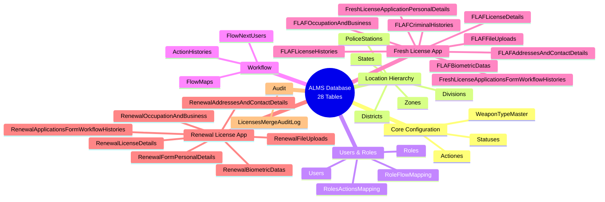
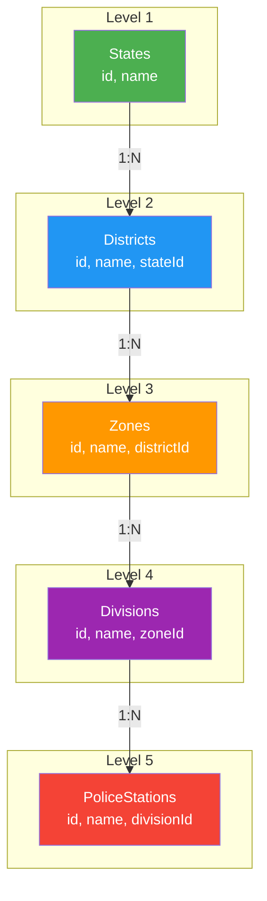
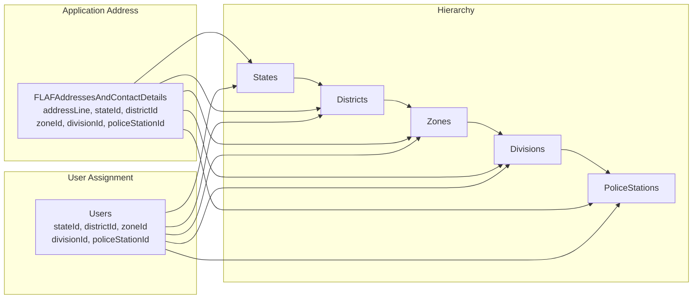
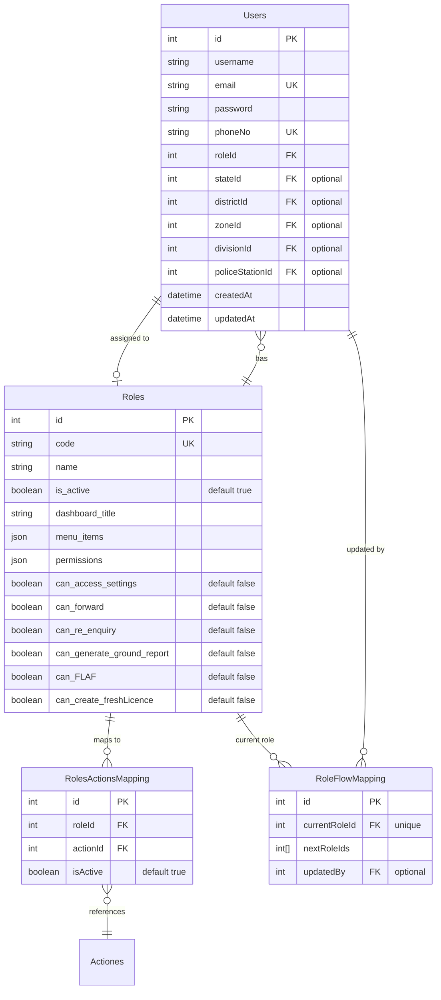
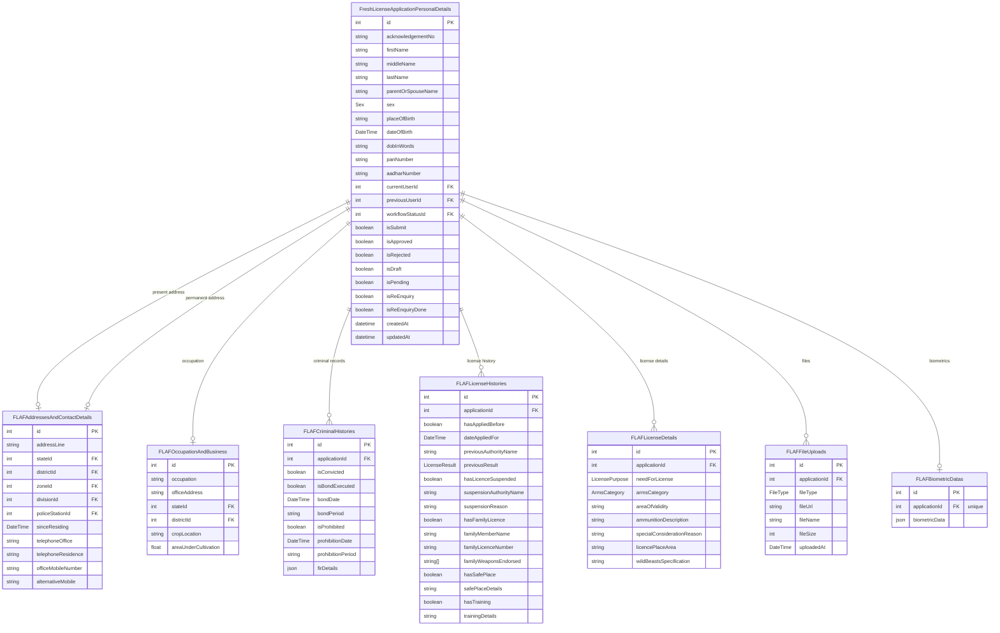
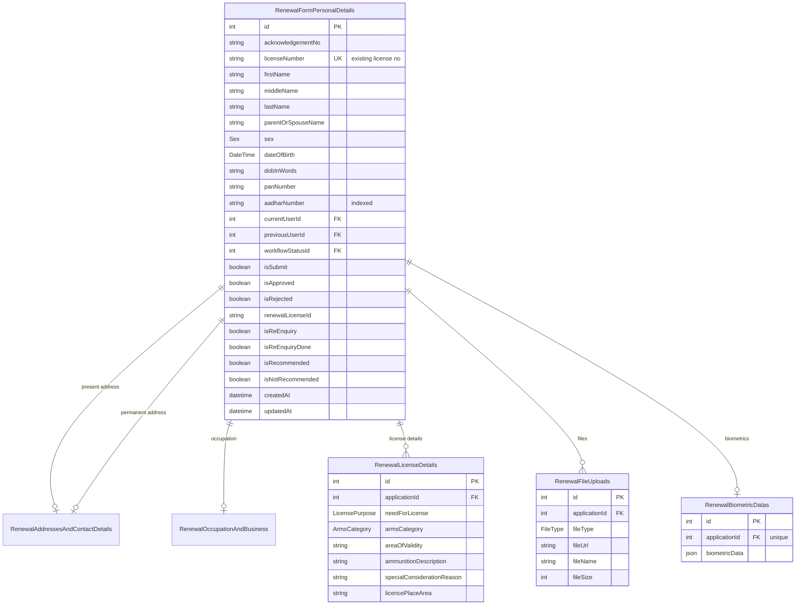
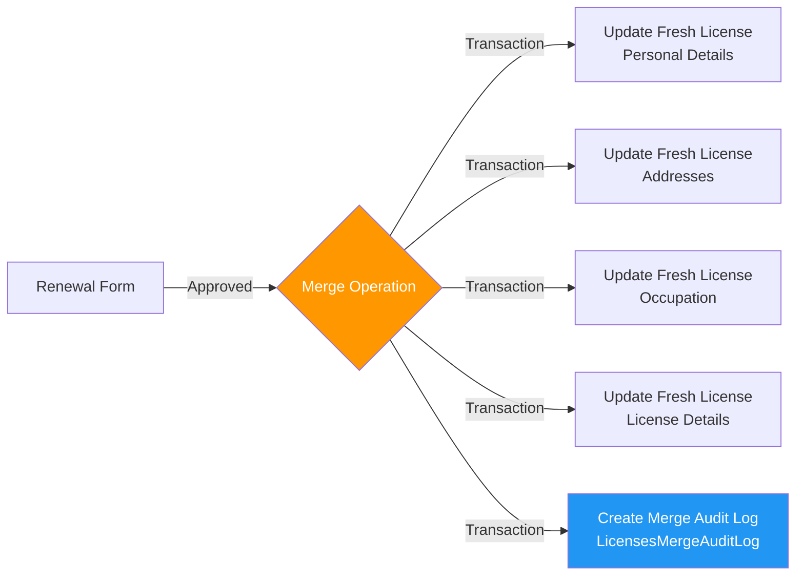
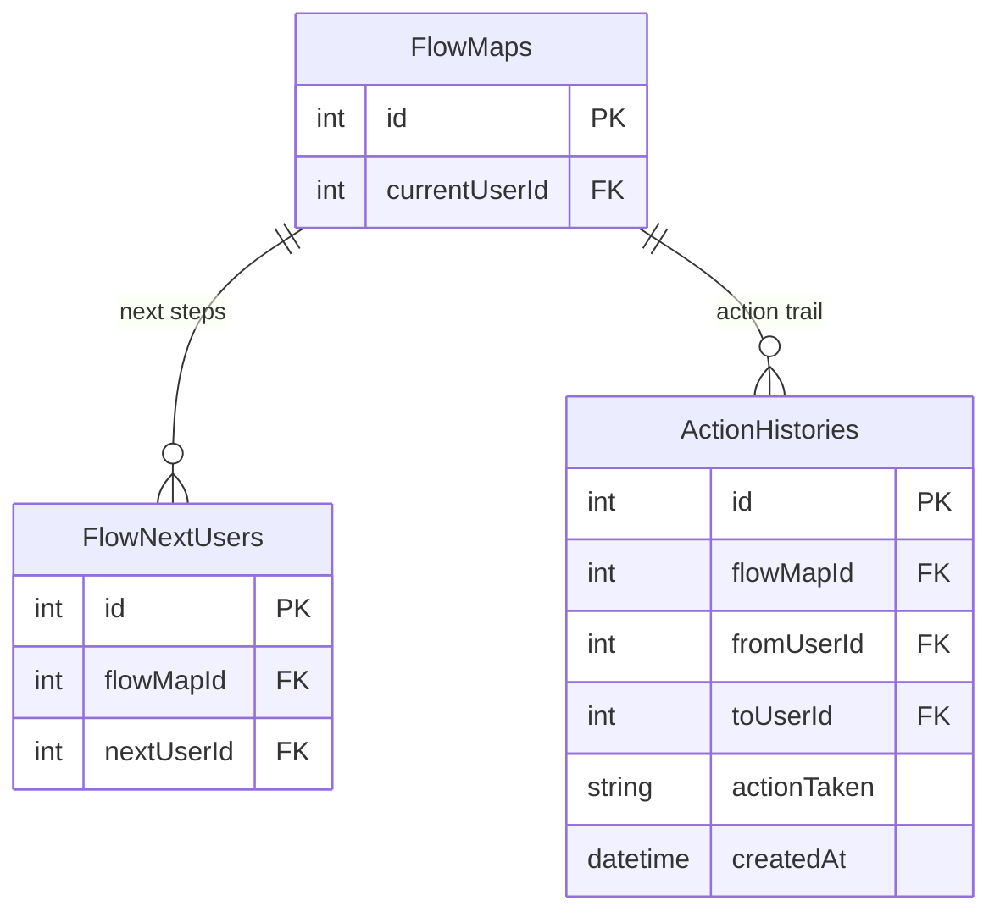
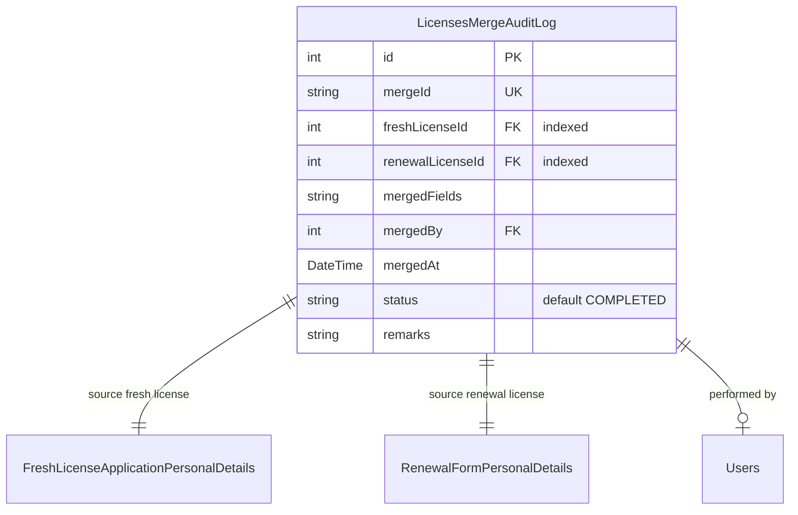

# ALMS Database Schema Documentation

> **Arms License Management System** — Complete Database Reference

---

## Table of Contents

1. [Database Overview](#1-database-overview)
2. [Complete Entity Relationship Diagram](#2-complete-entity-relationship-diagram)
3. [Enums](#3-enums)
4. [Core Configuration Models](#4-core-configuration-models)
5. [Location Hierarchy](#5-location-hierarchy)
6. [Users & Roles](#6-users--roles)
7. [Fresh License Application Models](#7-fresh-license-application-models)
8. [Renewal License Application Models](#8-renewal-license-application-models)
9. [Workflow & History Models](#9-workflow--history-models)
10. [Merge & Audit Models](#10-merge--audit-models)
11. [Index Summary](#11-index-summary)
12. [Relationship Summary](#12-relationship-summary)

---

## 1. Database Overview

**Database Statistics:**
- **Total Models:** 28
- **Enums:** 7
- **Relations:** 85+ between models
- **Indexes:** 8 defined indexes
- **Unique Constraints:** 12+
- **Database:** PostgreSQL 14+

---

## 2. Complete Entity Relationship Diagram

### 2.1 Master ER Diagram

```mermaid
erDiagram
    Statuses ||--o{ FreshLicenseApplicationPersonalDetails : "has workflow status"
    Statuses ||--o{ RenewalFormPersonalDetails : "has renewal workflow status"
    Actiones ||--o{ FreshLicenseApplicationsFormWorkflowHistories : "action history"
    Actiones ||--o{ RenewalApplicationsFormWorkflowHistories : "renewal action history"
    Actiones ||--o{ RolesActionsMapping : "mapped to roles"

    Roles ||--o{ Users : "has users"
    Roles ||--o{ RolesActionsMapping : "has action mappings"
    Roles ||--o{ RoleFlowMapping : "current role flow"
    Roles ||--o{ FreshLicenseApplicationsFormWorkflowHistories : "workflow next/prev role"
    Roles ||--o{ RenewalApplicationsFormWorkflowHistories : "renewal workflow next/prev role"

    RoleFlowMapping ||--o| Roles : "current role"
    RoleFlowMapping ||--o| Users : "updated by"

    Users ||--o{ FreshLicenseApplicationPersonalDetails : "current/previous owner"
    Users ||--o{ RenewalFormPersonalDetails : "renewal current/previous owner"
    Users ||--o{ FreshLicenseApplicationsFormWorkflowHistories : "workflow next/prev user"
    Users ||--o{ RenewalApplicationsFormWorkflowHistories : "renewal workflow next/prev user"
    Users ||--o{ FlowMaps : "owns flow maps"
    Users ||--o{ FlowNextUsers : "next user in flow"
    Users ||--o{ ActionHistories : "action from/to user"
    Users ||--o{ LicensesMergeAuditLog : "performed merge"
    Users ||--o{ RoleFlowMapping : "updated flow mapping"

    States ||--o{ Districts : "contains"
    States ||--o{ Users : "state users"
    States ||--o{ FLAFAddressesAndContactDetails : "state addresses"
    States ||--o{ FLAFOccupationAndBusiness : "state occupations"
    States ||--o{ RenewalAddressesAndContactDetails : "renewal state addresses"
    States ||--o{ RenewalOccupationAndBusiness : "renewal state occupations"

    Districts ||--o{ Zones : "contains"
    Districts ||--o{ FLAFAddressesAndContactDetails : "district addresses"
    Districts ||--o{ FLAFOccupationAndBusiness : "district occupations"
    Districts ||--o{ RenewalAddressesAndContactDetails : "renewal district addresses"
    Districts ||--o{ RenewalOccupationAndBusiness : "renewal district occupations"

    Zones ||--o{ Divisions : "contains"
    Zones ||--o{ FLAFAddressesAndContactDetails : "zone addresses"
    Zones ||--o{ RenewalAddressesAndContactDetails : "renewal zone addresses"

    Divisions ||--o{ PoliceStations : "contains"
    Divisions ||--o{ FLAFAddressesAndContactDetails : "division addresses"
    Divisions ||--o{ RenewalAddressesAndContactDetails : "renewal division addresses"

    PoliceStations ||--o{ FLAFAddressesAndContactDetails : "station addresses"
    PoliceStations ||--o{ RenewalAddressesAndContactDetails : "renewal station addresses"

    FreshLicenseApplicationPersonalDetails ||--o| FLAFBiometricDatas : "has biometrics"
    FreshLicenseApplicationPersonalDetails ||--o{ FLAFCriminalHistories : "has criminal records"
    FreshLicenseApplicationPersonalDetails ||--o{ FLAFFileUploads : "has files"
    FreshLicenseApplicationPersonalDetails ||--o{ FLAFLicenseDetails : "has license details"
    FreshLicenseApplicationPersonalDetails ||--o{ FLAFLicenseHistories : "has license history"
    FreshLicenseApplicationPersonalDetails ||--o| FLAFAddressesAndContactDetails : "present address"
    FreshLicenseApplicationPersonalDetails ||--o| FLAFAddressesAndContactDetails : "permanent address"
    FreshLicenseApplicationPersonalDetails ||--o| FLAFOccupationAndBusiness : "occupation"
    FreshLicenseApplicationPersonalDetails ||--o{ FreshLicenseApplicationsFormWorkflowHistories : "workflow history"
    FreshLicenseApplicationPersonalDetails ||--o{ LicensesMergeAuditLog : "merge log"

    RenewalFormPersonalDetails ||--o| RenewalBiometricDatas : "has biometrics"
    RenewalFormPersonalDetails ||--o{ RenewalLicenseDetails : "has license details"
    RenewalFormPersonalDetails ||--o{ RenewalFileUploads : "has files"
    RenewalFormPersonalDetails ||--o| RenewalAddressesAndContactDetails : "present address"
    RenewalFormPersonalDetails ||--o| RenewalAddressesAndContactDetails : "permanent address"
    RenewalFormPersonalDetails ||--o| RenewalOccupationAndBusiness : "occupation"
    RenewalFormPersonalDetails ||--o{ RenewalApplicationsFormWorkflowHistories : "workflow history"
    RenewalFormPersonalDetails ||--o{ LicensesMergeAuditLog : "merge log"

    WeaponTypeMaster ||--o{ FLAFLicenseDetails : "requested weapons"
    WeaponTypeMaster ||--o{ RenewalLicenseDetails : "renewal requested weapons"

    FlowMaps ||--o{ FlowNextUsers : "has next users"
    FlowMaps ||--o{ ActionHistories : "has action history"
```

---

## 3. Enums

### 3.1 Sex
| Value | Description |
|-------|-------------|
| `MALE` | Male |
| `FEMALE` | Female |
| `OTHER` | Other |

### 3.2 ArmsCategory
| Value | Description |
|-------|-------------|
| `RESTRICTED` | Restricted weapons (prohibited arms) |
| `PERMISSIBLE` | Permissible/licensable weapons |

### 3.3 AreaOfUse
| Value | Description |
|-------|-------------|
| `DISTRICT` | Valid within district only |
| `STATE` | Valid within state |
| `INDIA` | Valid nationwide |

### 3.4 previousStatusOfLicence
| Value | Description |
|-------|-------------|
| `APPROVED` | Previously approved |
| `PENDING` | Previously pending |
| `REJECTED` | Previously rejected |

### 3.5 FileType
| Value | Description |
|-------|-------------|
| `AADHAR_CARD` | Aadhar card document |
| `PAN_CARD` | PAN card document |
| `TRAINING_CERTIFICATE` | Weapon training certificate |
| `OTHER_STATE_LICENSE` | License from another state |
| `EXISTING_LICENSE` | Current license document |
| `SAFE_CUSTODY` | Safe custody proof |
| `MEDICAL_REPORT` | Medical fitness report |
| `REJECTED_LICENSE` | Previously rejected license |
| `CLAIM_DOCS` | Claim documents |
| `SIGNATURE_THUMB` | Signature or thumb impression |
| `PHOTOGRAPH` | Applicant photograph |
| `IRIS_SCAN` | Iris scan data |
| `OTHER` | Other documents |

### 3.6 LicensePurpose
| Value | Description |
|-------|-------------|
| `SELF_PROTECTION` | Personal safety/self-defense |
| `SPORTS` | Sports shooting |
| `HEIRLOOM_POLICY` | Family heirlom / inheritance policy |

### 3.7 LicenseResult
| Value | Description |
|-------|-------------|
| `APPROVED` | License/application approved |
| `REJECTED` | License/application rejected |
| `PENDING` | License/application pending |

---

## 4. Core Configuration Models

### 4.1 Statuses

Workflow status definitions for fresh and renewal applications.

| Field | Type | Constraint | Default | Description |
|-------|------|-----------|---------|-------------|
| `id` | Int | PK, Autoincrement | | Unique status identifier |
| `code` | String | **UNIQUE** | | Status code (e.g., DRAFT, INITIATE, APPROVED) |
| `name` | String | Required | | Human-readable status name |
| `description` | String? | Optional | | Status description |
| `isActive` | Boolean | | `true` | Whether status is active |
| `isStarted` | Boolean | | `false` | Whether this is a starting status |
| `createdAt` | DateTime | | `now()` | Creation timestamp |
| `updatedAt` | DateTime | | `updatedAt` | Last update timestamp |

**Relations:**
| Relation | Target | Cardinality |
|----------|--------|-------------|
| `applications` | FreshLicenseApplicationPersonalDetails | One-to-Many |
| `renewalApplications` | RenewalFormPersonalDetails | One-to-Many |

---

### 4.2 Actiones

Available workflow actions (forward, approve, reject, re-enquiry, etc.).

| Field | Type | Constraint | Default | Description |
|-------|------|-----------|---------|-------------|
| `id` | Int | PK, Autoincrement | | Unique action identifier |
| `code` | String | **UNIQUE** | | Action code (e.g., FORWARD, APPROVED, REJECT) |
| `name` | String | Required | | Human-readable action name |
| `description` | String? | Optional | | Action description |
| `isActive` | Boolean | | `true` | Whether action is active |
| `createdAt` | DateTime | | `now()` | Creation timestamp |
| `updatedAt` | DateTime | | `updatedAt` | Last update timestamp |

**Relations:**
| Relation | Target | Cardinality |
|----------|--------|-------------|
| `applicationsHistory` | FreshLicenseApplicationsFormWorkflowHistories | One-to-Many |
| `renewalApplicationsHistory` | RenewalApplicationsFormWorkflowHistories | One-to-Many |
| `rolesActionsMapping` | RolesActionsMapping | One-to-Many |

---

### 4.3 WeaponTypeMaster

Master list of weapon types available for license applications.

| Field | Type | Constraint | Default | Description |
|-------|------|-----------|---------|-------------|
| `id` | Int | PK, Autoincrement | | Unique weapon type identifier |
| `name` | String | **UNIQUE** | | Weapon type name (e.g., Pistol, Rifle, Shotgun) |
| `description` | String? | Optional | | Weapon description |
| `imageUrl` | String? | Optional | | Weapon image URL |

**Relations:**
| Relation | Target | Cardinality |
|----------|--------|-------------|
| `licenseDetails` | FLAFLicenseDetails | Many-to-Many |
| `renewalLicenseDetails` | RenewalLicenseDetails | Many-to-Many |

---

## 5. Location Hierarchy

### 5.1 Location Hierarchy Tree

### 5.2 States

| Field | Type | Constraint | Description |
|-------|------|-----------|-------------|
| `id` | Int | PK, Autoincrement | State identifier |
| `name` | String | **UNIQUE** | State name |
| `createdAt` | DateTime | `now()` | Creation timestamp |
| `updatedAt` | DateTime | `updatedAt` | Last update |

**Referenced By:** Districts, FLAFAddresses, FLAFOccupation, RenewalAddresses, RenewalOccupation, Users

### 5.3 Districts

| Field | Type | Constraint | Description |
|-------|------|-----------|-------------|
| `id` | Int | PK, Autoincrement | District identifier |
| `name` | String | **UNIQUE** | District name |
| `stateId` | Int | FK → States.id | Parent state |
| `createdAt` | DateTime | `now()` | |
| `updatedAt` | DateTime | `updatedAt` | |

### 5.4 Zones

| Field | Type | Constraint | Description |
|-------|------|-----------|-------------|
| `id` | Int | PK, Autoincrement | Zone identifier |
| `name` | String | **UNIQUE** | Zone name |
| `districtId` | Int | FK → Districts.id | Parent district |
| `createdAt` | DateTime | `now()` | |
| `updatedAt` | DateTime | `updatedAt` | |

### 5.5 Divisions

| Field | Type | Constraint | Description |
|-------|------|-----------|-------------|
| `id` | Int | PK, Autoincrement | Division identifier |
| `name` | String | **UNIQUE** | Division name |
| `zoneId` | Int | FK → Zones.id | Parent zone |
| `createdAt` | DateTime | `now()` | |
| `updatedAt` | DateTime | `updatedAt` | |

### 5.6 PoliceStations

| Field | Type | Constraint | Description |
|-------|------|-----------|-------------|
| `id` | Int | PK, Autoincrement | Police station identifier |
| `name` | String | **UNIQUE** | Police station name |
| `divisionId` | Int | FK → Divisions.id | Parent division |
| `createdAt` | DateTime | `now()` | |
| `updatedAt` | DateTime | `updatedAt` | |

### 5.7 Location Relationship Summary

---

## 6. Users & Roles

### 6.1 Users & Roles Relationship Diagram

### 6.2 Roles

| Field | Type | Default | Description |
|-------|------|---------|-------------|
| `id` | Int (PK) | Autoincrement | Role identifier |
| `code` | String | **UNIQUE** | Role code (SHO, ZS, ACP, DCP, etc.) |
| `name` | String | | Human-readable role name |
| `is_active` | Boolean | `true` | Whether role is active |
| `dashboard_title` | String | | Dashboard title for frontend |
| `menu_items` | Json? | | Menu configuration (JSON array) |
| `permissions` | Json? | | Permission flags (JSON array) |
| `can_access_settings` | Boolean | `false` | Can access settings |
| `can_forward` | Boolean | `false` | Can forward applications |
| `can_re_enquiry` | Boolean | `false` | Can request re-enquiry |
| `can_generate_ground_report` | Boolean | `false` | Can generate ground report |
| `can_FLAF` | Boolean | `false` | Can access FLAF functionality |
| `can_create_freshLicence` | Boolean | `false` | Can create fresh license |

### 6.3 Users

| Field | Type | Constraint | Description |
|-------|------|-----------|-------------|
| `id` | Int | PK, Autoincrement | User identifier |
| `username` | String | Required | Login username |
| `email` | String? | **UNIQUE** | Email address |
| `password` | String | Required | bcrypt-hashed password |
| `phoneNo` | String? | **UNIQUE** | Phone number |
| `roleId` | Int | FK → Roles.id | User's role |
| `stateId` | Int? | FK → States.id | User's state jurisdiction |
| `districtId` | Int? | FK → Districts.id | User's district |
| `zoneId` | Int? | FK → Zones.id | User's zone |
| `divisionId` | Int? | FK → Divisions.id | User's division |
| `policeStationId` | Int? | FK → PoliceStations.id | User's police station |

### 6.4 RolesActionsMapping

Maps which actions are available to which roles.

| Field | Type | Constraint | Description |
|-------|------|-----------|-------------|
| `id` | Int | PK, Autoincrement | |
| `roleId` | Int | FK → Roles.id | Role |
| `actionId` | Int | FK → Actiones.id | Action |
| `isActive` | Boolean | `true` | Whether mapping is active |
| **Unique** | `[roleId, actionId]` | | Prevents duplicate mappings |

### 6.5 RoleFlowMapping

Defines which roles an application can flow to from a given role.

| Field | Type | Constraint | Description |
|-------|------|-----------|-------------|
| `id` | Int | PK, Autoincrement | |
| `currentRoleId` | Int | FK → Roles.id, **UNIQUE** | Source role |
| `nextRoleIds` | Int[] | Array | Array of target role IDs |
| `updatedBy` | Int? | FK → Users.id | Who last updated |

---

## 7. Fresh License Application Models

### 7.1 Fresh Application Data Model

### 7.2 FreshLicenseApplicationPersonalDetails

The central model for fresh license applications. Links to all sub-sections.

| Field | Type | Constraint | Description |
|-------|------|-----------|-------------|
| `id` | Int | PK | Application ID |
| `acknowledgementNo` | String? | | Unique acknowledgement number |
| `firstName` | String | Required | Applicant first name |
| `middleName` | String? | | Applicant middle name |
| `lastName` | String | Required | Applicant last name |
| `parentOrSpouseName` | String | Required | Parent or spouse name |
| `sex` | Sex (enum) | Required | Gender |
| `placeOfBirth` | String? | | Birth place |
| `dateOfBirth` | DateTime? | | Date of birth |
| `dobInWords` | String? | | DOB in words |
| `panNumber` | String? | | PAN card number |
| `aadharNumber` | String? | **Indexed** | Aadhar number |
| `currentUserId` | Int? | FK → Users.id | Current processing officer |
| `previousUserId` | Int? | FK → Users.id | Previous processing officer |
| `workflowStatusId` | Int? | FK → Statuses.id | Current workflow status |
| `isSubmit` | Boolean? | `false` | Whether submitted |
| `isApproved` | Boolean? | `false` | Approval flag |
| `isRejected` | Boolean? | `false` | Rejection flag |
| `isFLAFGenerated` | Boolean? | `false` | FLAF generated flag |
| `isGroundReportGenerated` | Boolean? | `false` | Ground report flag |
| `isPending` | Boolean? | `false` | Pending flag |
| `isReEnquiry` | Boolean? | `false` | Re-enquiry flag |
| `isReEnquiryDone` | Boolean? | `false` | Re-enquiry completed |
| `isRecommended` | Boolean? | `false` | Recommended flag |
| `isNotRecommended` | Boolean? | `false` | Not recommended |
| `isDeclarationAccepted` | Boolean? | `false` | Declaration accepted |
| `isAwareOfLegalConsequences` | Boolean? | `false` | Legal awareness |
| `isTermsAccepted` | Boolean? | `false` | Terms accepted |
| `almsLicenseId` | String? | | ALMS license ID |
| `filledBy` | String? | | Who filled the form |

### 7.3 Related Sub-Models

| Model | Cardinality | Description |
|-------|-------------|-------------|
| `FLAFAddressesAndContactDetails` | Two (present + permanent) | Addresses with full location hierarchy |
| `FLAFOccupationAndBusiness` | One | Occupation and business details |
| `FLAFCriminalHistories` | Many | Criminal history records |
| `FLAFLicenseHistories` | Many | Previous license history |
| `FLAFLicenseDetails` | Many | Requested weapons & license specifications |
| `FLAFFileUploads` | Many | Uploaded documents |
| `FLAFBiometricDatas` | One (1:1) | Fingerprint/biometric data (encrypted) |
| `FreshLicenseApplicationsFormWorkflowHistories` | Many | Workflow audit trail |

---

## 8. Renewal License Application Models

### 8.1 Renewal Application Data Model

### 8.2 RenewalFormPersonalDetails

Mirrors fresh license structure but keyed by existing `licenseNumber`.

| Field | Type | Unique/Index | Description |
|-------|------|-------------|-------------|
| `id` | Int (PK) | | Renewal application ID |
| `licenseNumber` | String | **UNIQUE** | Existing license number to renew |
| `renewalLicenseId` | String? | | New renewal license ID |
| `acknowledgementNo` | String? | | Acknowledgement number |
| ... | (same as FreshLicense fields) | | Same personal details fields |
| `aadharNumber` | String? | **Indexed** | For lookup |
| `licenseNumber` | String | **Indexed** | For lookup |

### 8.3 Business Logic: License Merge

---

## 9. Workflow & History Models

### 9.1 Workflow Flow Models

### 9.2 FreshLicenseApplicationsFormWorkflowHistories

Audit trail for every action taken on a fresh license application.

| Field | Type | FK To | Description |
|-------|------|-------|-------------|
| `id` | Int (PK) | | History record ID |
| `applicationId` | Int | FreshLicenseApplicationPersonalDetails.id | Related application |
| `previousUserId` | Int | Users.id | Previous officer |
| `nextUserId` | Int | Users.id | Next officer |
| `actionTaken` | String | | Action code (FORWARD, APPROVED, etc.) |
| `remarks` | String? | | Officer remarks |
| `previousRoleId` | Int? | Roles.id | Previous role |
| `nextRoleId` | Int? | Roles.id | Next role |
| `actionesId` | Int? | Actiones.id | Related action definition |
| `attachments` | Json? | | Attachments metadata |
| `createdAt` | DateTime | | Timestamp |

### 9.3 RenewalApplicationsFormWorkflowHistories

Same structure as fresh workflow histories but for renewal applications.

| Field | Type | FK To |
|-------|------|-------|
| Same fields as FreshLicenseApplicationsFormWorkflowHistories | | RenewalFormPersonalDetails.id instead |

---

## 10. Merge & Audit Models

### 10.1 LicensesMergeAuditLog

Tracks all merge operations between renewal and fresh licenses.

| Field | Type | Constraint | Description |
|-------|------|-----------|-------------|
| `id` | Int | PK, Autoincrement | Audit record ID |
| `mergeId` | String | **UNIQUE** | Generated merge identifier |
| `freshLicenseId` | Int | FK → FreshLicenseApplicationPersonalDetails.id | Fresh license merged into |
| `renewalLicenseId` | Int | FK → RenewalFormPersonalDetails.id | Renewal license source |
| `mergedFields` | String? | | JSON array of merged field names |
| `mergedBy` | Int? | FK → Users.id | User who performed merge |
| `mergedAt` | DateTime | `now()` | Merge timestamp |
| `status` | String | `"COMPLETED"` | Merge status |
| `remarks` | String? | | Merge remarks |

**Indexes:** `freshLicenseId`, `renewalLicenseId`, `mergeId`

---

## 11. Index Summary

| Table | Indexed Field(s) | Purpose |
|-------|-----------------|---------|
| `FreshLicenseApplicationPersonalDetails` | `aadharNumber` | Quick lookup by Aadhar |
| `RenewalFormPersonalDetails` | `aadharNumber` | Quick lookup by Aadhar |
| `RenewalFormPersonalDetails` | `licenseNumber` | Quick lookup by license |
| `LicensesMergeAuditLog` | `freshLicenseId` | Find merges by fresh license |
| `LicensesMergeAuditLog` | `renewalLicenseId` | Find merges by renewal license |
| `LicensesMergeAuditLog` | `mergeId` | Unique merge lookup |
| `RolesActionsMapping` | `[roleId, actionId]` (Unique) | Prevent duplicate role-action |
| `RoleFlowMapping` | `currentRoleId` (Unique) | One flow config per role |

---

## 12. Relationship Summary

### 12.1 Cascade Delete Rules

All foreign keys use **`onDelete: Cascade`** except:

| FK | Model | Rule | Reason |
|----|-------|------|--------|
| `mergedBy` on `LicensesMergeAuditLog` | Users | `SetNull` | Preserve audit trail even if user deleted |

### 12.2 One-to-One Relationships

| Left | Right | Field |
|------|-------|-------|
| `FreshLicenseApplicationPersonalDetails` | `FLAFBiometricDatas` | `applicationId` (unique) |
| `RenewalFormPersonalDetails` | `RenewalBiometricDatas` | `applicationId` (unique) |
| `Roles` | `RoleFlowMapping` | `currentRoleId` (unique) |

### 12.3 Key Composite Unique Constraints

| Table | Fields | Purpose |
|-------|--------|---------|
| `RolesActionsMapping` | `[roleId, actionId]` | One action per role |

---

> **Document Version:** 2.0  
> **Generated:** 2025  
> **Project:** ALMS — Arms License Management System  
> **Database:** PostgreSQL 14+  
> **ORM:** Prisma 5  
> **Total Models:** 28 | **Enums:** 7 | **Indexes:** 8
