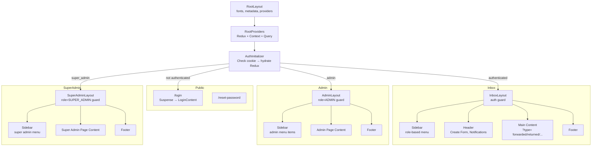
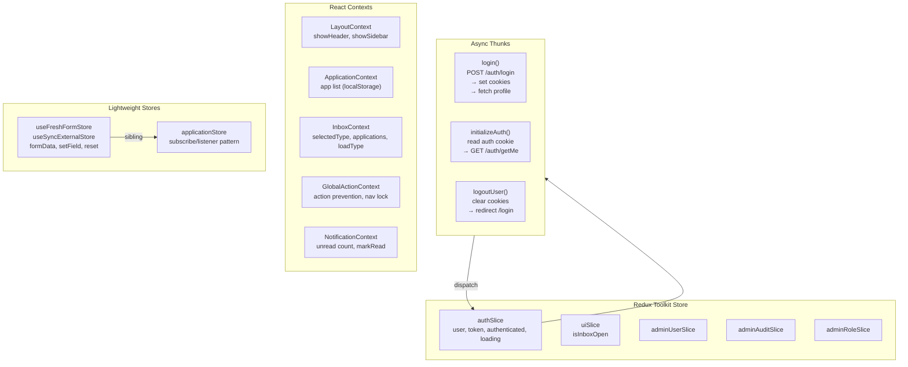
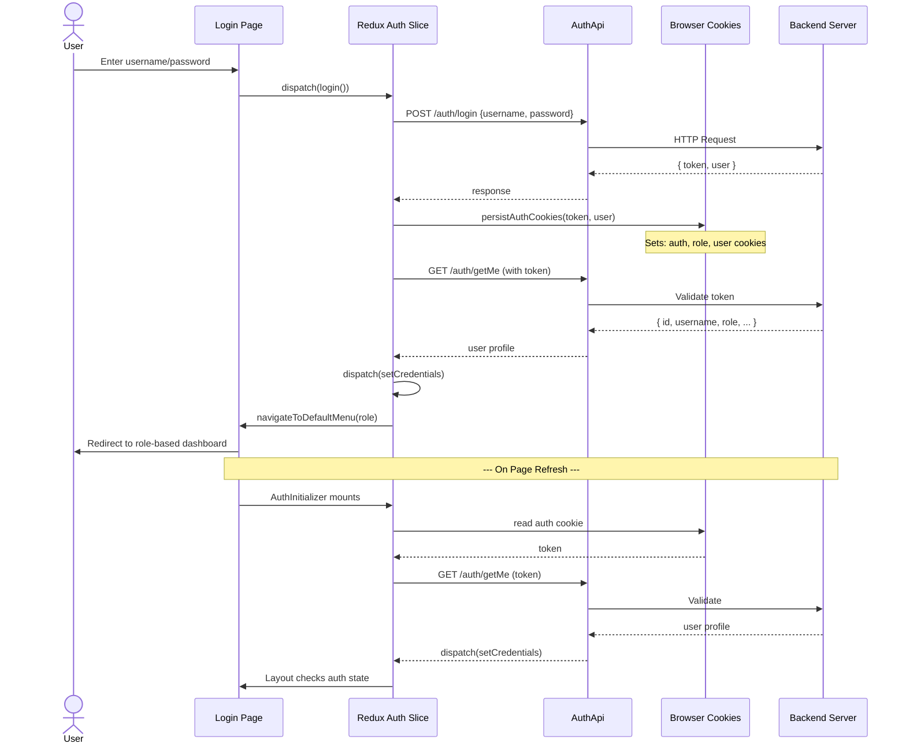
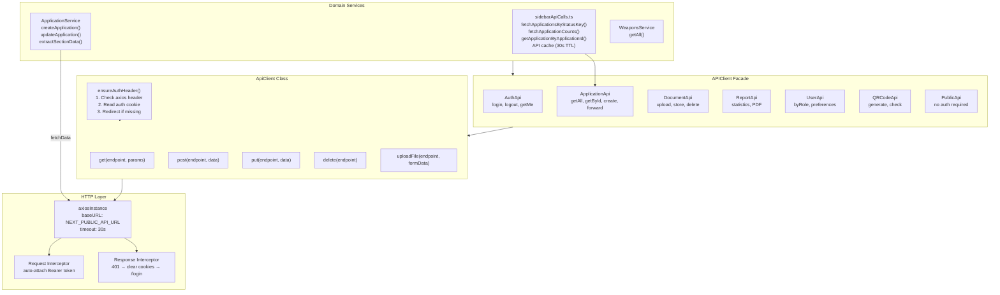
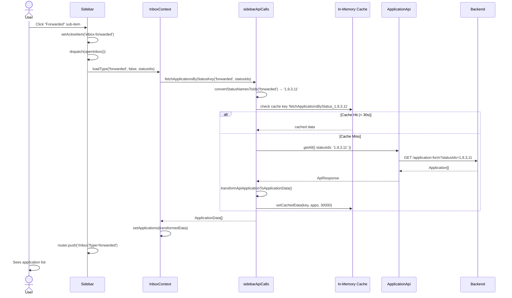
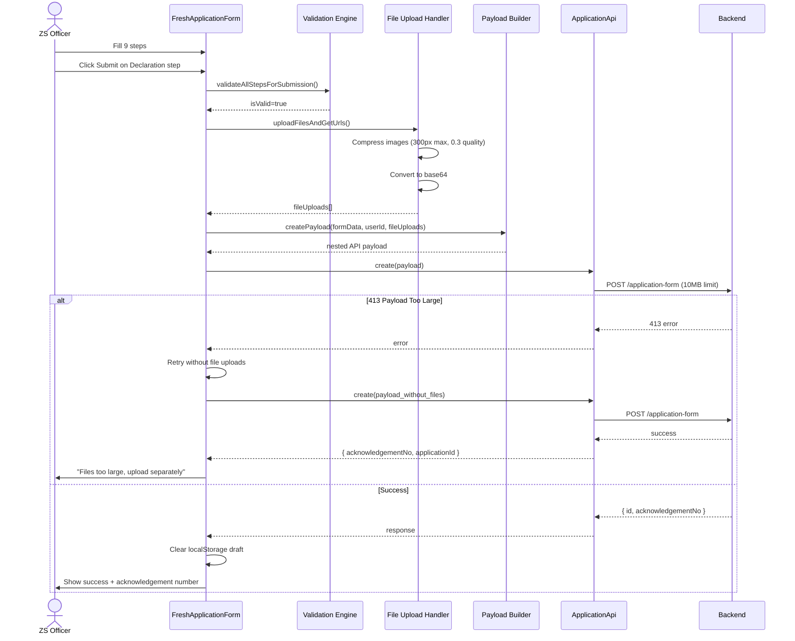
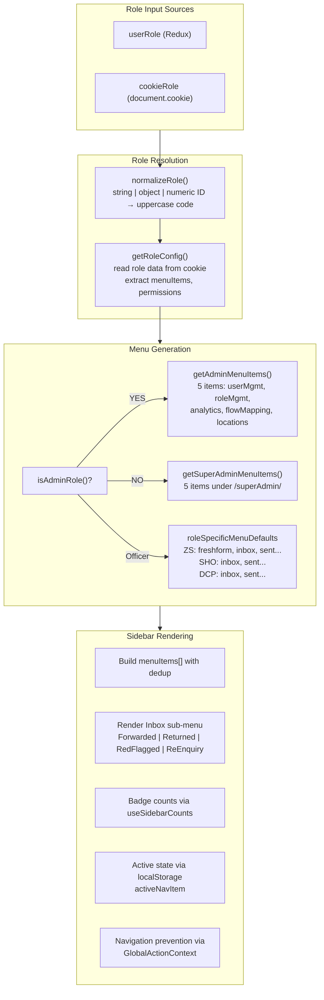
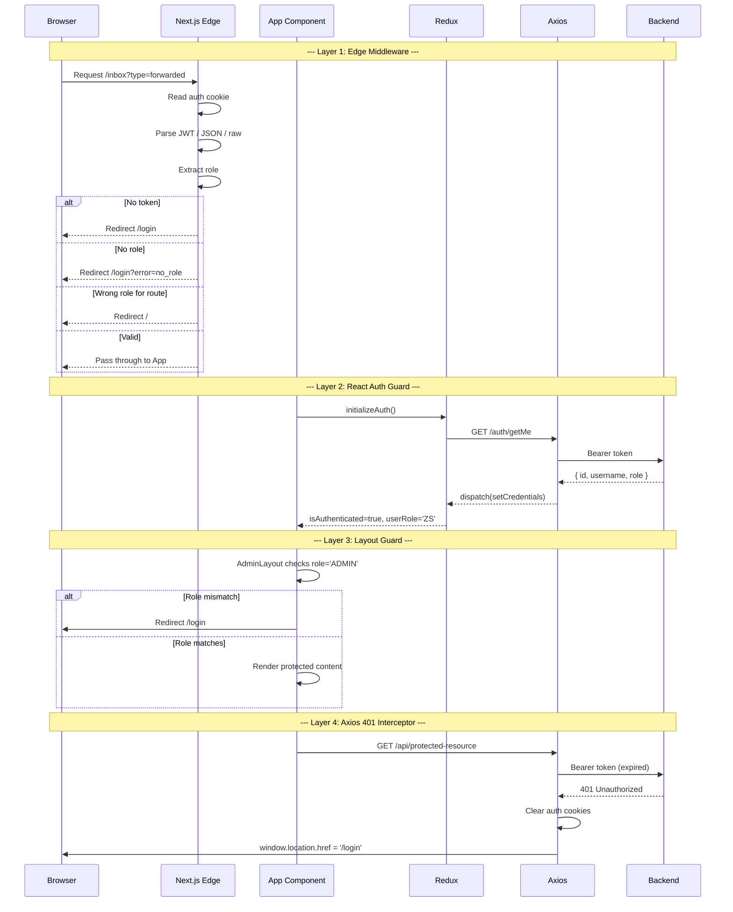

# ALMS Frontend Architecture — Complete Reference

> **Stack:** Next.js 15 · React 18 · TypeScript 5 · Tailwind CSS 3 · Redux Toolkit  
> **Port:** 5000 (dev) · **Node:** ^18+

---

## Architecture Overview

```mermaid
graph TB
    subgraph "Client Browser"
        A[User Browser] --> B[Next.js App Router]
        B --> C[Middleware Edge]
        C -->|Auth Check| D{Authenticated?}
        D -->|No| E[/login]
        D -->|Yes| F[Role Router]
        F --> G[InboxLayout]
        F --> H[AdminLayout]
        F --> I[SuperAdminLayout]
    end

    subgraph "State Layer"
        J[Redux Store] --> K[authSlice]
        J --> L[uiSlice]
        J --> M[adminSlices]
        N[React Context] --> O[InboxContext]
        N --> P[GlobalActionContext]
        N --> Q[ApplicationContext]
    end

    subgraph "API Layer"
        R[Axios Instance] --> S[Auth Interceptor]
        S --> T[APIClient]
        T --> U[AuthApi]
        T --> V[ApplicationApi]
        T --> W[Services]
    end

    G --> N
    H --> J
    F --> J
    T --> X[Backend /api/*]
```

---

## Page Route Map

```mermaid
graph LR
    Login[/login] -->|authenticate| Root[/]
    Root -->|ADMIN| Admin{Admin Portal}
    Root -->|SUPER_ADMIN| SuperAdmin{Super Admin Portal}
    Root -->|Officer Role| Inbox{Inbox System}
    Root -->|APPLICANT| Inbox

    Admin -->|menu| UM[/admin/userManagement]
    Admin -->|menu| RM[/admin/roleMapping]
    Admin -->|menu| AN[/admin/analytics]
    Admin -->|menu| FM[/admin/flowMapping]
    Admin -->|menu| LM[/admin/locationsManagement]

    SuperAdmin -->|menu| SUM[/superAdmin/userManagement]
    SuperAdmin -->|menu| SRM[/superAdmin/roleMapping]
    SuperAdmin -->|menu| SAN[/superAdmin/analytics]
    SuperAdmin -->|menu| SFM[/superAdmin/flowMapping]
    SuperAdmin -->|menu| SLM[/superAdmin/locationsManagement]

    Inbox -->|type=forwarded| FWD[Forwarded Apps]
    Inbox -->|type=returned| RET[Returned Apps]
    Inbox -->|type=redflagged| FLG[Red Flagged Apps]
    Inbox -->|type=reenquiry| REQ[Re-Enquiry Apps]
    Inbox -->|type=sent| SENT[Sent Apps]
    Inbox -->|type=all| ALL[Combined View]
    Inbox -->|analytics| INA[/inbox/analytics]

    Root -->|ZS| FreshForm[Fresh Application Form]
    FreshForm -->|9 Steps| Submit[Submit to Backend]
```

---

## Layout Hierarchy



---

## Provider Composition Tree

```mermaid
flowchart LR
    Provider["Provider (Redux)"]
    QC["QueryClientProvider<br/>@tanstack/react-query<br/>stale:5m, gc:10m"]
    LP["LayoutProvider<br/>showHeader / showSidebar"]
    NP["NotificationProvider<br/>bell badge count"]
    ATP["AdminThemeProvider<br/>light/dark mode"]
    AAP["AdminAuthProvider"]
    AMP["AdminMenuProvider"]
    UP["UserProvider"]
    AP["ApplicationProvider<br/>localStorage persist"]
    IP["InboxProvider<br/>type + data loading"]
    GAP["GlobalActionProvider<br/>prevent duplicate nav"]
    AI["AuthInitializer"]
    Children["{children}"]

    Provider --> QC --> LP --> NP --> ATP --> AAP --> AMP --> UP --> AP --> IP --> GAP
    GAP --> AI
    GAP --> Children
```



---

## State Management Architecture



---

## Authentication Flow



---

## API Integration Layer



---

## Data Fetching Flow (Inbox Example)



---

## Form Submission Flow



---

## Role-Based Menu System



---

## Component Inventory

### Top-Level Components

| Component | File | Lines | Purpose |
|---|---|---|---|
| **Sidebar** | `Sidebar.tsx` | ~900 | Role-based navigation with inbox sub-menu |
| **Header** | `Header.tsx` | ~400 | Top bar with create form, notifications, print |
| **RootProviders** | `RootProviders.tsx` | ~60 | Provider composition root |
| **AuthInitializer** | `AuthInitializer.tsx` | ~50 | Auth bootstrap on mount |
| **ProtectedRoute** | `ProtectedRoute.tsx` | ~50 | Route guard wrapper |
| **LoginForm** | `LoginForm.tsx` | ~60 | Simple login form (legacy) |
| **Navbar** | `Navbar.tsx` | ~40 | Simple top nav (legacy) |
| **Footer** | `Footer.tsx` | ~30 | App footer |

### Admin UI Kit (`components/admin/`)

| Component | Purpose | Props |
|---|---|---|
| `AdminTable` | Sortable/filterable table | columns, data, loading, pagination |
| `AdminCard` | Info card | title, children, className |
| `AdminModal` | Dialog | isOpen, onClose, title, size, children |
| `AdminFilter` | Search + date range | onFilter, onReset |
| `AdminToolbar` | Action buttons | buttons, className |
| `AdminErrorAlert` | Error display | message, onRetry |
| `AdminErrorBoundary` | Error boundary | children, fallback |
| `AdminFormSkeleton` | Form loader | rows, columns |
| `AdminTableSkeleton` | Table loader | rows, columns |
| `AdminCardSkeleton` | Card loader | count |
| `AdminSectionSkeleton` | Section loader | - |
| `Breadcrumb` | Navigation trail | items[] |
| `ConfirmationDialog` | Confirm/cancel | isOpen, message, onConfirm, onCancel |
| `PermissionMatrix` | Role-permission grid | roles, permissions |
| `RoleFormModal` | Role create/edit | role, onSave, onClose |
| `RoleTable` | Roles list | roles, onEdit, onDelete |
| `WorkflowGraphPreview` | Workflow diagram | flowData |

### Analytics Components (`components/analytics/`)

| Component | Purpose |
|---|---|
| `AnalyticsDashboard` | Main wrapper with stats, charts, table |
| `AdminActivityFeed` | Recent action timeline |
| `FiltersHeader` | Date range + dropdown filters |
| `SummaryStats` | KPI cards (pending, approved, rejected, returned) |
| `TimelineChart` | Line chart of applications over time |
| `RoleLoadChart` | Workload per role bar chart |
| `StatusDistributionChart` | Pie/bar by status |
| `ApplicationsTable` | Filterable application list |

### Form Section Components (`components/forms/freshApplication/`)

| Component | Step | Key Fields |
|---|---|---|
| `PersonalInformation` | 1 | Name, DOB, PAN, Aadhar, Mobile, Email |
| `AddressDetails` | 2 | Present/Permanent address, LocationCascade |
| `OccupationBussiness` | 3 | Occupation, Office address, Crop, Cultivation |
| `CriminalHistory` | 4 | Dynamic array: convicted, FIR, case pending |
| `LicenseHistory` | 5 | Previous apps, family licenses, training |
| `LicenseDetails` | 6 | Weapon, category, validity, ammunition |
| `BiometricInformation` | 7 | Signature, Iris, Photograph |
| `DocumentsUpload` | 8 | Aadhar, PAN, Photo, Certificates |
| `Preview` | 9 | Read-only review |
| `Declaration` | 9 | Truth declaration, legal acceptance |

### Form UI Elements (`components/forms/elements/`)

```
Button, Input, Select, Checkbox, DateOfBirth, FileUpload,
FormField, Card, Alert, LocationHierarchy, StepHeader, Tooltip, footer
```

---

## Redux State Shape

```typescript
interface RootState {
  auth: {
    isAuthenticated: boolean;
    user: User | null;
    token: string | null;
    loading: boolean;
    error: string | null;
    initialized: boolean;
  };
  ui: {
    isInboxOpen: boolean;
  };
  adminUsers: { /* admin user CRUD state */ };
  adminAudit: { /* audit log state */ };
  adminRoles: { /* role management state */ };
}
```

---

## Fresh Application Data Model

```mermaid
erDiagram
    ApplicationForm {
        int id PK
        string acknowledgementNo UK
        string firstName
        string middleName
        string lastName
        string parentOrSpouseName
        enum sex "MALE | FEMALE | OTHER"
        string placeOfBirth
        date dateOfBirth
        string panNumber
        string aadharNumber
        int currentUserId FK
        int workflowStatusId FK
        boolean isApproved
        boolean isRejected
        boolean isPending
        boolean isReEnquiry
    }

    PresentAddress {
        int id PK
        string addressLine
        int stateId FK
        int districtId FK
        int zoneId FK
        int divisionId FK
        int policeStationId FK
        date sinceResiding
        string officeMobile
    }

    PermanentAddress {
        int id PK
        string addressLine
        int stateId FK
        int districtId FK
        int zoneId FK
        int divisionId FK
        int policeStationId FK
        date sinceResiding
    }

    OccupationBusiness {
        int id PK
        string occupation
        string officeAddress
        int stateId FK
        int districtId FK
        string cropLocation
        float areaUnderCultivation
    }

    CriminalHistory {
        int id PK
        int applicationId FK
        boolean isConvicted
        boolean isBondExecuted
        date bondDate
        boolean isProhibited
        json firDetails
    }

    LicenseHistory {
        int id PK
        int applicationId FK
        boolean hasAppliedBefore
        boolean hasLicenceSuspended
        boolean hasFamilyLicence
        boolean hasSafePlace
        boolean hasTraining
    }

    LicenseDetails {
        int id PK
        int applicationId FK
        enum needForLicense "SELF_PROTECTION | SPORTS | HEIRLOOM"
        enum armsCategory "RESTRICTED | PERMISSIBLE"
        string areaOfValidity
    }

    BiometricData {
        int id PK
        int applicationId FK UK
        json biometricData "signature, iris, photo URLs"
    }

    FileUploads {
        int id PK
        int applicationId FK
        enum fileType "AADHAR_CARD | PAN_CARD | PHOTOGRAPH | ..."
        string fileUrl
        string fileName
        int fileSize
    }

    WorkflowHistory {
        int id PK
        int applicationId FK
        int previousUserId FK
        int nextUserId FK
        string actionTaken
        string remarks
        int previousRoleId FK
        int nextRoleId FK
        json attachments
    }

    ApplicationForm ||--o{ PresentAddress : "present address"
    ApplicationForm ||--o{ PermanentAddress : "permanent address"
    ApplicationForm ||--o{ OccupationBusiness : "occupation"
    ApplicationForm ||--o{ CriminalHistory : "criminal records"
    ApplicationForm ||--o{ LicenseHistory : "license history"
    ApplicationForm ||--o{ LicenseDetails : "license details"
    ApplicationForm ||--o| BiometricData : "biometric"
    ApplicationForm ||--o{ FileUploads : "documents"
    ApplicationForm ||--o{ WorkflowHistory : "workflow trail"
```

---

## Security & Auth Architecture



---

## Status ID Mapping & Menu System

```mermaid
flowchart LR
    subgraph Menu["Sidebar Menu Items"]
        ZS["ZS Menu<br/>freshform[9], inbox[1,9],<br/>sent, closed, drafts,<br/>finaldisposal, analytics"]
        SHO["SHO Menu<br/>inbox[1,9], sent"]
        DCP["DCP Menu<br/>inbox[1,9,11], sent"]
        CP["CP Menu<br/>inbox[1,9,11], sent,<br/>analytics"]
    end

    subgraph Statuses["Backend Status Codes"]
        S1["1: FORWARD"]
        S2["2: REJECT"]
        S3["3: APPROVED"]
        S4["4: CANCEL"]
        S5["5: RE_ENQUIRY"]
        S6["6: GROUND_REPORT"]
        S7["7: DISPOSE"]
        S8["8: RED_FLAG"]
        S9["9: INITIATE"]
        S10["10: CLOSE"]
        S11["11: RECOMMEND"]
        S12["12: DRAFT"]
    end

    Menu -->|statusIdMap| Statuses
```



---

## Developer Quick Reference

### Directory Map
```
src/
├── app/           # Pages (Next.js App Router)
├── api/           # Axios config
├── components/    # All React components
├── config/        # Config, API clients, roles
├── context/       # React Context providers
├── hooks/         # Custom hooks
├── services/      # Data services
├── store/         # Redux store
├── stores/        # Lightweight stores
├── styles/        # Admin design system
├── types/         # TypeScript interfaces
└── utils/         # Utilities
```

### Key Patterns
1. **Auth**: Redux + cookies + middleware (3-layer)
2. **API**: Axios → ApiClient → APIClient facade → Domain services
3. **State**: Redux (global) → Context (feature) → useState (local)
4. **Forms**: Controlled components, per-step validation, draft in localStorage
5. **Navigation**: Sidebar menu → role-based redirect → inbox type system

### Environment Variables
```
NEXT_PUBLIC_API_URL = http://localhost:3001/api
BACKEND_URL          = http://localhost:3001
PORT                 = 5000
```

---

*Generated: June 2026 | ALMS Frontend v1.0*
