# ALMS — Renewal API Workflow Documentation

> **Version:** 1.0  
> **Last Updated:** 17 June 2026  
> **Module:** Renewal License Application  
> **System:** Arms License Management System (ALMS)

---

## Table of Contents

1. [Overview](#1-overview)
2. [Architecture Diagram](#2-architecture-diagram)
3. [API Endpoints Reference](#3-api-endpoints-reference)
4. [Database Schema](#4-database-schema)
5. [End-to-End Workflow](#5-end-to-end-workflow)
6. [Data Loading Strategy](#6-data-loading-strategy)
7. [Scenario Walkthroughs](#7-scenario-walkthroughs)
8. [Frontend State Management](#8-frontend-state-management)
9. [Data Field Mapping](#9-data-field-mapping)
10. [File Upload & Document Handling](#10-file-upload--document-handling)
11. [Officer Workflow Hierarchy & Post-Submission Actions](#11-officer-workflow-hierarchy--post-submission-actions)
12. [DTOs Reference](#12-dtos-reference)
13. [Error Handling & Edge Cases](#13-error-handling--edge-cases)
14. [Best Practices & Optimization](#14-best-practices--optimization)

---

## 1. Overview

The Renewal module allows applicants with an existing **Fresh** (approved and issued) to apply for license renewal. The workflow is designed to:

- **Pre-fill** the renewal form from existing application data (minimizing re-entry)
- **Avoid redundant API calls** by checking for existing renewals first
- **Use a single source of truth** — once a renewal record exists, it becomes the authoritative data source
- **Support progressive saving** via the PATCH API with section-based payloads

### Key Principles

| Principle                  | Description                                                                                                                                  |
| -------------------------- | -------------------------------------------------------------------------------------------------------------------------------------------- |
| **Single Source of Truth** | Once a `renewalId` exists, the Renewal GET API is the only data source. Fresh application data is never re-fetched.                          |
| **Lazy Creation**          | A renewal DRAFT is created only when no existing renewal is found for the license number.                                                    |
| **Section-Based Patching** | The PATCH API accepts partial payloads, so only changed sections are sent.                                                                   |
| **Idempotent Lookups**     | The `findRenewalByLicenseNumber` check prevents duplicate renewal records.                                                                   |
| **Shared Workflow**        | Renewal and Fresh applications share the same workflow engine (`Statuses`/`Actiones` tables), differentiated by `applicationType` parameter. |

### Tech Stack

| Layer            | Technology                                                  |
| ---------------- | ----------------------------------------------------------- |
| Frontend         | Next.js 15, React, TypeScript                               |
| Backend          | NestJS, TypeScript                                          |
| ORM              | Prisma                                                      |
| Database         | PostgreSQL                                                  |
| API Pattern      | REST with JWT Authentication                                |
| State Management | React local state (`useState`, `useRef`) — no Redux/Zustand |

---

## 2. Architecture Diagram

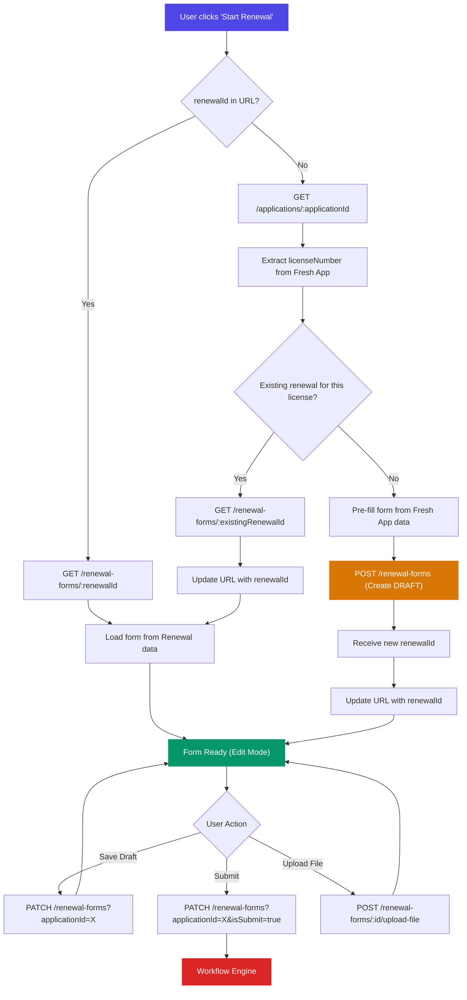

---

## 3. API Endpoints Reference

### 3.1 Renewal Form APIs

| Method   | Endpoint                                    | Description                       | Auth |
| -------- | ------------------------------------------- | --------------------------------- | ---- |
| `POST`   | `/renewal-forms`                            | Create a new renewal form (DRAFT) | JWT  |
| `GET`    | `/renewal-forms`                            | List/search renewal applications  | JWT  |
| `GET`    | `/renewal-forms/:applicationId`             | Get a specific renewal by ID      | JWT  |
| `PATCH`  | `/renewal-forms?applicationId=X`            | Update renewal sections           | JWT  |
| `POST`   | `/renewal-forms/:applicationId/upload-file` | Upload document to renewal        | JWT  |
| `DELETE` | `/renewal-forms/file/:fileId`               | Delete a specific document        | JWT  |
| `DELETE` | `/renewal-forms/application/:applicationId` | Delete entire DRAFT renewal       | JWT  |

### 3.2 Complete Endpoint Catalog (All 15 Endpoints)

| #   | Method   | Endpoint                                                         | Purpose                            | Auth |
| --- | -------- | ---------------------------------------------------------------- | ---------------------------------- | ---- |
| 1   | `POST`   | `/renewal-forms`                                                 | Create new renewal DRAFT           | JWT  |
| 2   | `GET`    | `/renewal-forms`                                                 | List/search renewals (paginated)   | JWT  |
| 3   | `GET`    | `/renewal-forms/:applicationId`                                  | Get renewal by ID                  | JWT  |
| 4   | `PATCH`  | `/renewal-forms?applicationId=X&isSubmit=Y`                      | Update/submit renewal              | JWT  |
| 5   | `POST`   | `/renewal-forms/:id/upload-file`                                 | Upload document                    | JWT  |
| 6   | `DELETE` | `/renewal-forms/file/:fileId`                                    | Delete document                    | JWT  |
| 7   | `DELETE` | `/renewal-forms/application/:id`                                 | Delete DRAFT renewal               | JWT  |
| 8   | `POST`   | `/renewal-forms/approved/merge`                                  | Merge into fresh license (JTCP/CP) | JWT  |
| 9   | `GET`    | `/renewal-forms/merge-audit-logs/all`                            | Merge audit trail                  | JWT  |
| 10  | `GET`    | `/renewal-forms/merge-audit-logs/:mergeId`                       | Specific merge log                 | JWT  |
| 11  | `GET`    | `/application-form?applicationId=X`                              | Fresh app data (for pre-fill)      | JWT  |
| 12  | `GET`    | `/workflow/statuses-actions`                                     | Workflow statuses & actions        | JWT  |
| 13  | `POST`   | `/workflow/action`                                               | Perform workflow action            | JWT  |
| 14  | `GET`    | `/workflow/applications?applicationType=RenewalApplicationForm`  | Renewal apps in workflow           | JWT  |
| 15  | `GET`    | `/users-in-hierarchy/:id?applicationType=RenewalApplicationForm` | Officers for forwarding            | JWT  |

### 3.3 API Configuration

The frontend uses **two API client patterns**:

| Client                         | File                                                                                                                  | Used By                                |
| ------------------------------ | --------------------------------------------------------------------------------------------------------------------- | -------------------------------------- |
| `apiClient` (class-based)      | [authenticatedApiClient.ts](file:///c:/Users/preml/Desktop/office/alms/frontend/src/config/authenticatedApiClient.ts) | `RenewalService`                       |
| `axiosConfig` (function-based) | [axiosConfig.ts](file:///c:/Users/preml/Desktop/office/alms/frontend/src/api/axiosConfig.ts)                          | `ApplicationService`, PATCH operations |

**Base URL:** `process.env.NEXT_PUBLIC_API_URL || '/api'`  
**Auth:** Bearer token from cookie (`jsCookie.get('auth')`)  
**Timeout:** 30,000ms  
**401 Handling:** Auto-redirect to `/login`

### 3.4 Detailed API Specifications

#### POST `/renewal-forms` — Create Renewal

**Purpose:** Creates a new renewal application record with DRAFT status.

**Request Body:**

```json
{
  "licenseNumber": "ARM-2025-001",
  "acknowledgementNo": "ALMS1696050000000",
  "firstName": "John",
  "middleName": "K",
  "lastName": "Doe",
  "parentOrSpouseName": "Richard Doe",
  "sex": "MALE",
  "dateOfBirth": "1985-05-15",
  "aadharNumber": "123456789012",
  "panNumber": "ABCPD1234F",
  "applicantMobile": "+91-9876543210",
  "applicantEmail": "john@example.com",
  "applicationType": "Renewal"
}
```

**Response (201):**

```json
{
  "success": true,
  "data": {
    "id": 42,
    "acknowledgementNo": "ALMS1696050000042",
    "licenseNumber": "ARM-2025-001",
    "firstName": "John",
    "workflowStatus": { "id": 1, "code": "DRAFT", "name": "Draft" }
  }
}
```

**Error (400):** `"Renewal application for this license already exists"`

---

#### PATCH `/renewal-forms?applicationId=X` — Update Renewal

**Purpose:** Update one or more sections of the renewal form. Supports partial payloads.

**Query Parameters:**

| Param           | Type    | Required | Description                       |
| --------------- | ------- | -------- | --------------------------------- |
| `applicationId` | number  | Yes      | The renewal application ID        |
| `isSubmit`      | boolean | No       | Set `true` to submit after saving |

**Request Body (Section-Based):**

```json
{
  "personalDetails": {
    "firstName": "John",
    "middleName": "K",
    "lastName": "Doe",
    "parentOrSpouseName": "Richard Doe",
    "sex": "MALE",
    "dateOfBirth": "1985-05-15",
    "dobInWords": "Fifteenth May Nineteen Eighty Five",
    "panNumber": "ABCPD1234F",
    "aadharNumber": "123456789012"
  },
  "addressDetails": {
    "addressLine": "123 Main Street, Block A",
    "stateId": 1,
    "districtId": 1,
    "policeStationId": 1,
    "zoneId": 1,
    "divisionId": 1,
    "sinceResiding": "2020-05-15",
    "telephoneOffice": "+91-1234567890",
    "telephoneResidence": "+91-0987654321",
    "officeMobileNumber": "+91-9876543210",
    "alternativeMobile": "+91-9123456789"
  },
  "occupationAndBusiness": {
    "occupation": "Farmer",
    "officeAddress": "123 Market Street",
    "stateId": 1,
    "districtId": 1,
    "cropLocation": "Plot 123, Village XYZ",
    "areaUnderCultivation": 10.5
  },
  "licenseDetails": {
    "needForLicense": "SELF_PROTECTION",
    "armsCategory": "RESTRICTED",
    "areaOfValidity": "DISTRICT",
    "ammunitionDescription": "10 rounds per month",
    "specialConsiderationReason": "High crime area",
    "licencePlaceArea": "Residence",
    "requestedWeaponIds": [1, 2, 3]
  },
  "licenseHistories": [
    {
      "hasAppliedBefore": true,
      "dateAppliedFor": "2024-01-15",
      "previousAuthorityName": "DM Office",
      "previousResult": "APPROVED"
    }
  ],
  "acceptanceFlags": {
    "isDeclarationAccepted": true,
    "isAwareOfLegalConsequences": true,
    "isTermsAccepted": true
  }
}
```

---

#### POST `/renewal-forms/:applicationId/upload-file` — Upload Document

**Request Body:**

```json
{
  "fileType": "AADHAR_CARD",
  "fileUrl": "data:image/png;base64,...",
  "fileName": "aadhar_front.png",
  "fileSize": 245000
}
```

**Supported File Types:**

| File Type Key          | Description                 |
| ---------------------- | --------------------------- |
| `AADHAR_CARD`          | Aadhaar / ID Proof          |
| `PAN_CARD`             | PAN Card                    |
| `TRAINING_CERTIFICATE` | Arms Training Certificate   |
| `MEDICAL_REPORT`       | Medical Fitness Certificate |
| `OTHER_STATE_LICENSE`  | License from Another State  |
| `EXISTING_LICENSE`     | Current Arms License Copy   |
| `SAFE_CUSTODY`         | Safe Custody Proof          |
| `PHOTOGRAPH`           | Applicant Photograph        |
| `SIGNATURE_THUMB`      | Signature / Fingerprint     |
| `IRIS_SCAN`            | Iris Scan Data              |
| `CLAIM_DOCS`           | Special Claim Documents     |
| `OTHER`                | Other Supporting Documents  |

---

## 4. Database Schema

### 4.1 Entity-Relationship Diagram

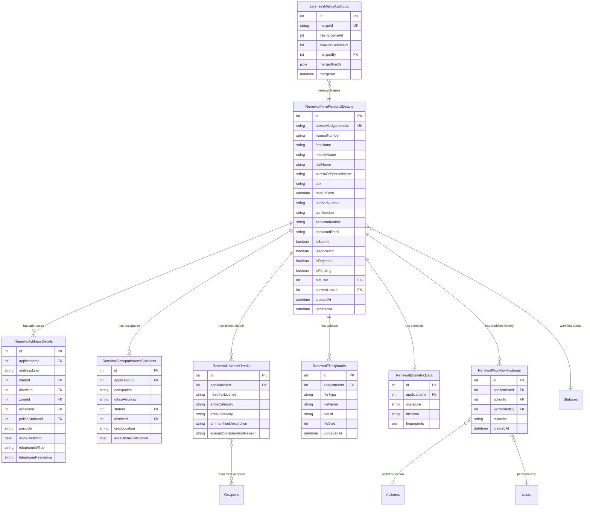

### 4.2 Table Summary

| #   | Table                                      | Purpose                       | FK Cascade        |
| --- | ------------------------------------------ | ----------------------------- | ----------------- |
| 1   | `RenewalFormPersonalDetails`               | Main application record       | —                 |
| 2   | `RenewalAddressesAndContactDetails`        | Present & permanent addresses | ON DELETE CASCADE |
| 3   | `RenewalOccupationAndBusiness`             | Occupation details            | ON DELETE CASCADE |
| 4   | `RenewalLicenseDetails`                    | License specifications        | ON DELETE CASCADE |
| 5   | `RenewalFileUploads`                       | Document attachments          | ON DELETE CASCADE |
| 6   | `RenewalBiometricDatas`                    | Biometric capture data        | ON DELETE CASCADE |
| 7   | `RenewalApplicationsFormWorkflowHistories` | Workflow audit trail          | ON DELETE CASCADE |
| 8   | `_RenewalRequestedWeapons`                 | M:N weapons junction          | —                 |
| 9   | `LicensesMergeAuditLog`                    | Merge operation records       | —                 |

> [!NOTE]
> All child tables use `ON DELETE CASCADE` — deleting a renewal application automatically removes all related records.

---

## 5. End-to-End Workflow

### 5.1 Complete Flow — Decision Tree

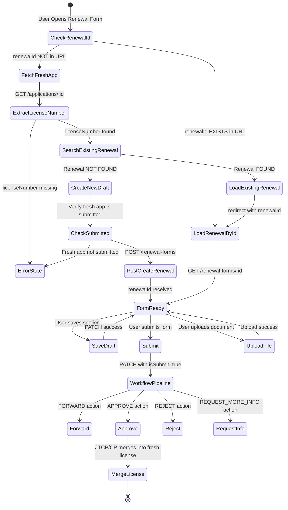

### 5.2 Step-by-Step API Call Sequence

#### Scenario: First-Time Renewal (No Existing Renewal)

```
Step 1:  GET  /applications/:applicationId          → Fetch fresh application data
Step 2:  GET  /renewal-forms?search=<licenseNumber>  → Check for existing renewal
Step 3:  POST /renewal-forms                         → Create new renewal DRAFT
Step 4:  POST /renewal-forms/:renewalId/upload-file  → Upload prefilled documents (per file)
Step 5:  PATCH /renewal-forms?applicationId=X        → Save draft changes
Step 6:  PATCH /renewal-forms?applicationId=X&isSubmit=true → Submit for review
```

#### Scenario: Returning to an Existing Renewal

```
Step 1:  GET  /renewal-forms/:renewalId              → Load renewal data directly
Step 2:  PATCH /renewal-forms?applicationId=X        → Save changes
Step 3:  PATCH /renewal-forms?applicationId=X&isSubmit=true → Submit
```

---

## 6. Data Loading Strategy

### 6.1 Decision Matrix — Which API to Call

| Condition                                                  | API Used                                           | Rationale                                     |
| ---------------------------------------------------------- | -------------------------------------------------- | --------------------------------------------- |
| `renewalId` is in URL params                               | `GET /renewal-forms/:renewalId`                    | Direct load — renewal is the source of truth  |
| `renewalId` NOT in URL, but renewal exists for the license | `GET /renewal-forms/:existingId`                   | Found via `findRenewalByLicenseNumber` search |
| No `renewalId`, no existing renewal                        | `GET /applications/:appId` → `POST /renewal-forms` | Pre-fill from fresh, then create DRAFT        |

### 6.2 Avoiding Redundant API Calls

> [!IMPORTANT]
> Once a `renewalId` is established, the Fresh Application GET API is **never called again**. This is a critical optimization.

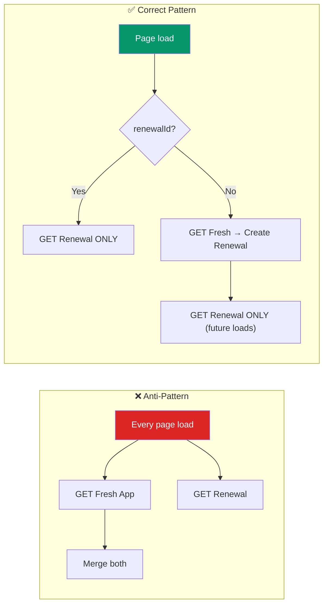

**Implementation in code** — from [page.tsx](file:///c:/Users/preml/Desktop/office/alms/frontend/src/app/forms/renewal/page.tsx#L2100-L2174):

```typescript
// Path A: renewalId is already known — load renewal directly, no fresh data needed.
if (renewalId) {
  await loadRenewalById(renewalId);
  return;
}

// Path B: Only applicationId — fetch fresh app, check for existing renewal.
// Step 1: Fetch fresh application data to extract licenseNumber.
const freshData = await fetchFreshApplicationWithFiles(applicationId);
const licenseNumber = getLicenseNumber(freshData);

// Step 2: Search for existing renewal by licenseNumber.
if (licenseNumber) {
  const existingRenewal = await RenewalService.findRenewalByLicenseNumber(licenseNumber);
  if (existingRenewal) {
    await loadRenewalById(existingRenewalId);
    return;
  }
}

// Step 3: No existing renewal — use fresh data to create new draft.
await createDraftRenewalFromFreshApplication(...);
```

---

## 7. Scenario Walkthroughs

### 7.1 Create New Renewal

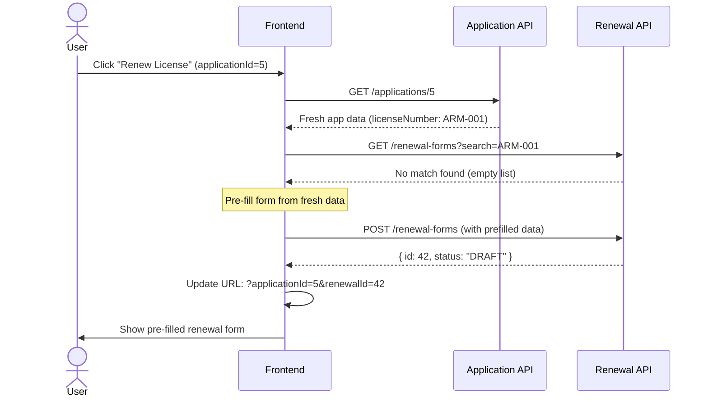

### 7.2 Edit Existing Draft

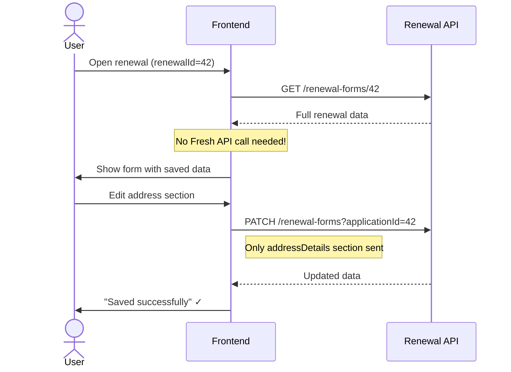

### 7.3 Save Draft (Progressive Save)

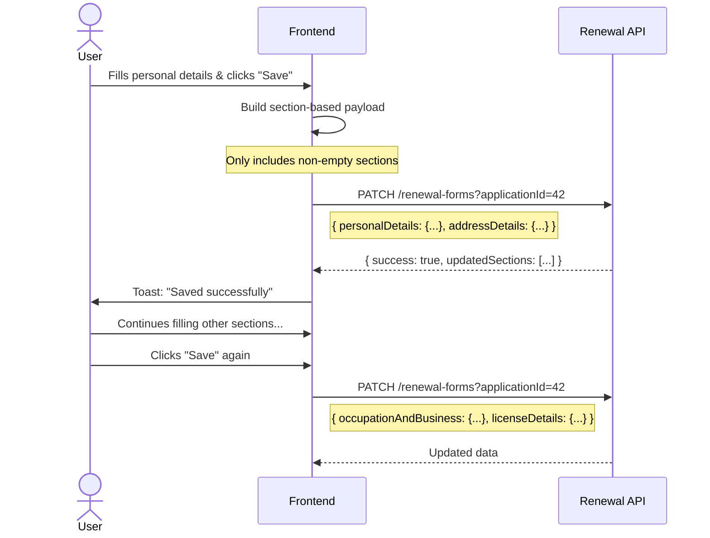

### 7.4 Submit Application

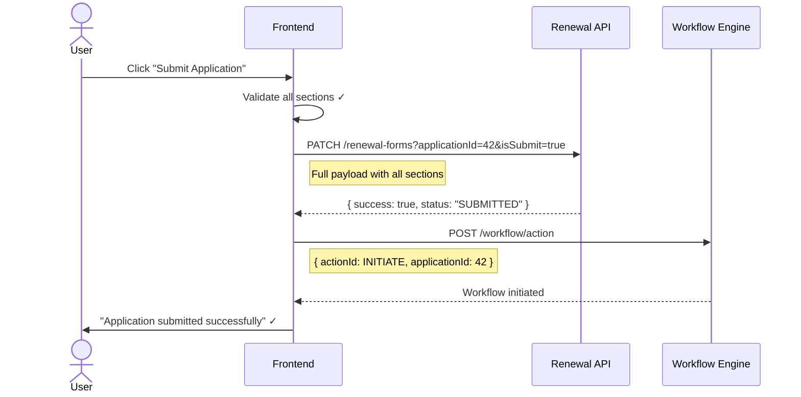

### 7.5 Resubmit After Rejection / Additional Info Request

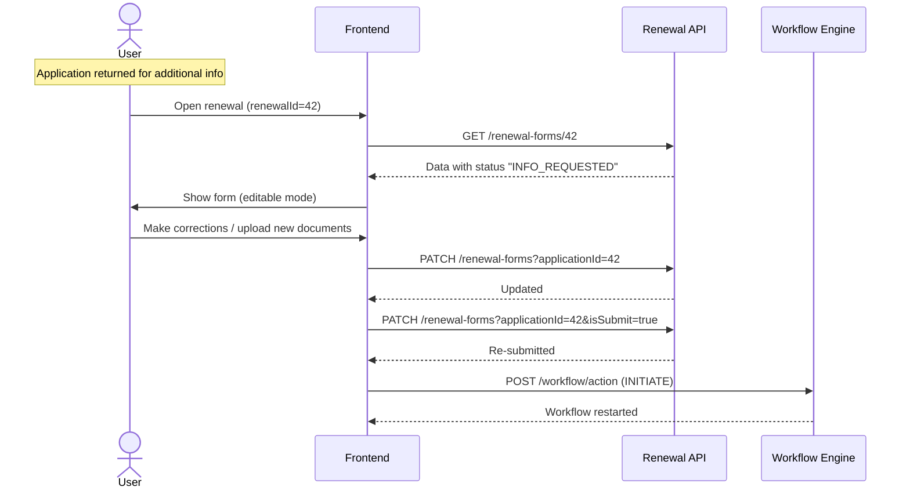

---

## 8. Frontend State Management

### 8.1 Architecture Overview

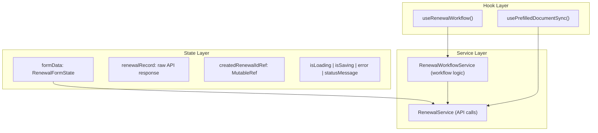

### 8.2 Key State Variables

| Variable              | Type               | Purpose                                            |
| --------------------- | ------------------ | -------------------------------------------------- |
| `formData`            | `RenewalFormState` | Complete form state with all sections              |
| `renewalRecord`       | `any`              | Raw API response (for merge logic)                 |
| `createdRenewalIdRef` | `Ref<string>`      | Tracks the renewal ID to prevent duplicate creates |
| `activeRenewalId`     | `string`           | `renewalId` from URL or `createdRenewalIdRef`      |
| `isLoading`           | `boolean`          | Initial data loading indicator                     |
| `isSaving`            | `boolean`          | Save/submit operation in progress                  |
| `isReadOnly`          | `boolean`          | True when status is APPROVED                       |

### 8.3 Form State Structure (`RenewalFormState`)

```typescript
type RenewalFormState = {
  // Identity
  renewalApplicationId: string;
  applicationId: string;
  licenseNumber: string;
  acknowledgementNo: string;

  // Personal Details
  applicantName: string;
  applicantMiddleName: string;
  applicantLastName: string;
  fatherName: string;
  motherName: string;
  maritalStatus: string;
  nationality: string;
  applicantGender: string;
  applicantDateOfBirth: string;
  // ... more personal fields

  // Address Details
  presentAddress: string;
  presentState: string; // Location ID (string)
  presentDistrict: string;
  presentZone: string;
  presentDivision: string;
  presentPoliceStation: string;
  // ... permanent address mirror fields

  // Occupation & Business
  occupation: string;
  officeBusinessAddress: string;
  officeBusinessState: string;
  officeBusinessDistrict: string;

  // License Details
  armsOptionType: string; // "RESTRICTED" | "PERMISSIBLE"
  weaponType: string;
  weaponReason: string;
  licenseValidity: string;
  requestedWeaponIds: number[];

  // Criminal History
  convictedStatus: boolean;
  bondStatus: boolean;
  // ... more criminal fields

  // License History
  hasPreviousLicense: boolean;
  hasAppliedBefore: boolean;
  // ... more history fields

  // Documents (File | upload metadata | null)
  idProofUploaded?: File | null;
  photographUploaded?: File | null;
  panCardUploaded?: File | null;
  // ... more document fields

  // Biometric
  selectedFingerprint?: string;
  signature?: string;
  irisScan?: string;

  // Declaration
  declaration: {
    agreeToTruth: boolean;
    understandLegalConsequences: boolean;
    agreeToTerms: boolean;
  };
};
```

### 8.4 Service Layer

#### RenewalService ([renewalService.ts](file:///c:/Users/preml/Desktop/office/alms/frontend/src/api/renewalService.ts))

| Method                                    | Description                                   |
| ----------------------------------------- | --------------------------------------------- |
| `findRenewalByLicenseNumber(license)`     | Search for existing renewal by license number |
| `createRenewalForm(payload)`              | POST — create new renewal draft               |
| `getRenewalForm(id)`                      | GET — fetch renewal by ID                     |
| `updateRenewalForm(id, payload, options)` | PATCH — update renewal sections               |
| `uploadDocument(id, fileType, file)`      | Upload file (auto base64 conversion)          |
| `deleteRenewalFile(fileId)`               | Delete uploaded document                      |
| `handleWorkflowAction(...)`               | Perform workflow action                       |

#### RenewalWorkflowService ([renewalWorkflowService.ts](file:///c:/Users/preml/Desktop/office/alms/frontend/src/services/renewalWorkflowService.ts))

| Method                                                  | Description                                |
| ------------------------------------------------------- | ------------------------------------------ |
| `submitRenewalForWorkflow(appId)`                       | Auto-resolve INITIATE action ID and submit |
| `forwardRenewalApplication(appId, nextUserId, remarks)` | Forward to next officer                    |
| `approveRenewalApplication(appId, remarks)`             | Approve the application                    |
| `rejectRenewalApplication(appId, remarks)`              | Reject the application                     |
| `requestInfoRenewalApplication(appId, remarks)`         | Request more info from applicant           |
| `disposeRenewalApplication(appId, remarks)`             | Dispose the application                    |
| `raiseRedFlagRenewalApplication(appId, remarks)`        | Raise a red flag                           |

---

## 9. Data Field Mapping

### 9.1 Fresh Application → Renewal Form Mapping

The system maps data from the Fresh Application API response to the `RenewalFormState`. Key mappings:

| Fresh App Field                    | Renewal Form Field     | Notes                                      |
| ---------------------------------- | ---------------------- | ------------------------------------------ |
| `firstName`                        | `applicantName`        | Also checks `personalDetails.firstName`    |
| `middleName`                       | `applicantMiddleName`  |                                            |
| `lastName`                         | `applicantLastName`    |                                            |
| `parentOrSpouseName`               | `fatherName`           |                                            |
| `sex`                              | `applicantGender`      | Normalized: M→MALE, F→FEMALE               |
| `dateOfBirth`                      | `applicantDateOfBirth` | ISO date format (YYYY-MM-DD)               |
| `aadharNumber`                     | `aadharNumber`         |                                            |
| `panNumber`                        | `panNumber`            |                                            |
| `presentAddress.addressLine`       | `presentAddress`       |                                            |
| `presentAddress.stateId`           | `presentState`         | Stored as string                           |
| `occupationAndBusiness.occupation` | `occupation`           |                                            |
| `licenseDetails[0].needForLicense` | `weaponReason`         | Mapped: `SELF_PROTECTION` → `self_defense` |
| `licenseDetails[0].armsCategory`   | `armsOptionType`       | `RESTRICTED` or `PERMISSIBLE`              |

### 9.2 Renewal Form → PATCH API Payload Mapping

| Form Field                 | PATCH Payload Path                      | Notes                                              |
| -------------------------- | --------------------------------------- | -------------------------------------------------- |
| `applicantName`            | `personalDetails.firstName`             |                                                    |
| `fatherName`               | `personalDetails.parentOrSpouseName`    |                                                    |
| `presentAddress`           | `addressDetails.addressLine`            |                                                    |
| `presentState`             | `addressDetails.stateId`                | Converted to number                                |
| `occupation`               | `occupationAndBusiness.occupation`      |                                                    |
| `weaponReason`             | `licenseDetails.needForLicense`         | Reverse mapped: `self_defense` → `SELF_PROTECTION` |
| `carryAreaDistrict`        | `licenseDetails.areaOfValidity`         | Combined: "DISTRICT, STATE"                        |
| `declaration.agreeToTruth` | `acceptanceFlags.isDeclarationAccepted` |                                                    |

---

## 10. File Upload & Document Handling

### 10.1 Upload Flow

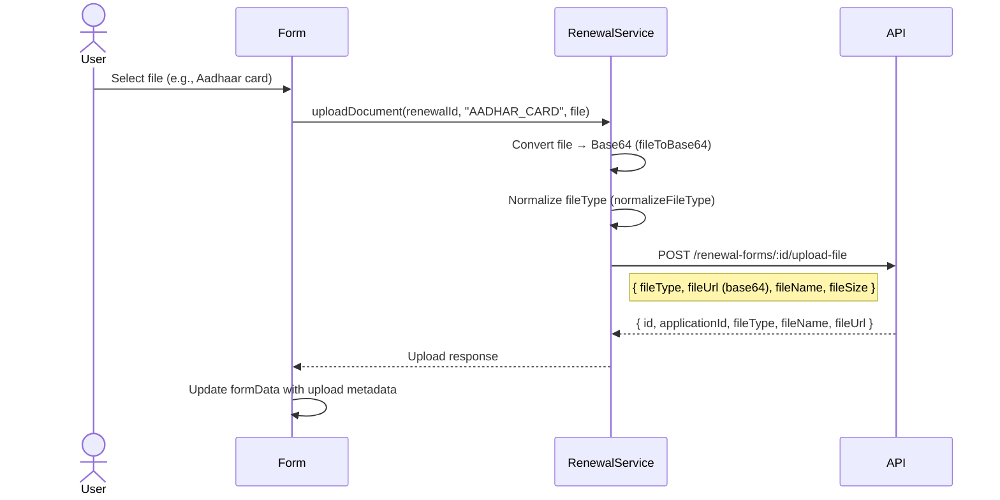

### 10.2 Pre-filled Document Sync

When a renewal is created from fresh application data, existing documents from the fresh application are automatically synced:

1. **During creation:** `applyPrefilledDocumentUploads()` iterates document fields
2. **For each prefilled doc:** Calls `POST /renewal-forms/:id/upload-file`
3. **Marks as synced:** Prevents duplicate re-uploads on subsequent loads
4. **Background sync:** `usePrefilledDocumentSync` hook handles evidence files asynchronously

### 10.3 File Type Normalization

```typescript
// Frontend field name → API file type mapping
const FILE_TYPE_MAP = {
  idProofUploaded: "AADHAR_CARD",
  panCardUploaded: "PAN_CARD",
  trainingCertificateUploaded: "TRAINING_CERTIFICATE",
  medicalCertificateUploaded: "MEDICAL_REPORT",
  otherStateLicenseUploaded: "OTHER_STATE_LICENSE",
  existingArmsLicenseUploaded: "EXISTING_LICENSE",
  safeCustodyUploaded: "SAFE_CUSTODY",
  photographUploaded: "PHOTOGRAPH",
  selectedFingerprint: "SIGNATURE_THUMB",
  signature: "SIGNATURE_THUMB",
  irisScan: "IRIS_SCAN",
  claimDocsUploaded: "CLAIM_DOCS",
};
```

---

## 11. Officer Workflow Hierarchy & Post-Submission Actions

### 11.1 Officer Role Hierarchy


| Role                  | Code   | Responsibility                                        |
| --------------------- | ------ | ----------------------------------------------------- |
| Applicant             | —      | Creates and submits renewal application               |
| Zonal Sergeant        | `ZS`   | Initial review, forwards to SHO                       |
| Station House Officer | `SHO`  | Station-level verification, Ground Report (via jsPDF) |
| Asst. Commissioner    | `ACP`  | Review and forward/recommend                          |
| Dy. Commissioner      | `DCP`  | Senior review and forward                             |
| Chief Admin Officer   | `CADO` | Administrative review                                 |
| Joint Commissioner    | `JTCP` | Final review, can merge licenses                      |
| Commissioner          | `CP`   | Final approval authority, can merge licenses          |

> [!IMPORTANT]
> Only **JTCP** and **CP** roles can perform the **Merge License** operation after approval.

### 11.2 Station-Side APIs (Officer Use)

Officers processing renewal applications use only 4 APIs:

| #   | API                                                                  | Purpose                                         |
| --- | -------------------------------------------------------------------- | ----------------------------------------------- |
| 1   | `GET /renewal-forms/:id`                                             | Load full renewal application details           |
| 2   | `GET /workflow/statuses-actions`                                     | Get available statuses and actions for the role |
| 3   | `GET /users-in-hierarchy/:id?applicationType=RenewalApplicationForm` | Get list of officers to forward to              |
| 4   | `POST /workflow/action`                                              | Perform action (forward, approve, reject, etc.) |

### 11.3 Workflow State Machine

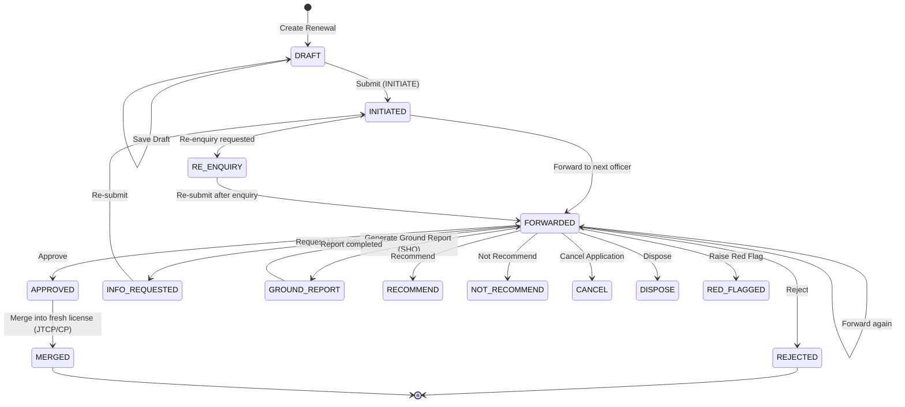

### 11.4 Workflow Status IDs

| ID  | Code            | Description               |
| --- | --------------- | ------------------------- |
| 1   | `FORWARD`       | Forwarded to next officer |
| 2   | `REJECT`        | Application rejected      |
| 3   | `APPROVED`      | Application approved      |
| 4   | `CANCEL`        | Application cancelled     |
| 5   | `RE_ENQUIRY`    | Re-enquiry requested      |
| —   | `DRAFT`         | Initial draft state       |
| —   | `INITIATED`     | Submitted for review      |
| —   | `RED_FLAG`      | Red flagged               |
| —   | `DISPOSE`       | Disposed                  |
| —   | `RECOMMEND`     | Recommended               |
| —   | `NOT_RECOMMEND` | Not recommended           |
| —   | `GROUND_REPORT` | Ground report generated   |

### 11.5 Workflow API Usage

All workflow actions use the unified `POST /workflow/action` endpoint, differentiated by `applicationType`:

```typescript
// Submit for review
await RenewalWorkflowService.submitRenewalForWorkflow(applicationId);

// Forward to next officer
await RenewalWorkflowService.forwardRenewalApplication(
  applicationId,
  nextUserId,
  remarks,
);

// Approve
await RenewalWorkflowService.approveRenewalApplication(applicationId, remarks);

// Reject
await RenewalWorkflowService.rejectRenewalApplication(applicationId, remarks);

// Request additional info
await RenewalWorkflowService.requestInfoRenewalApplication(
  applicationId,
  remarks,
);
```

**Payload structure:**

```json
{
  "applicationId": 42,
  "actionId": 1,
  "remarks": "Forwarding for review",
  "nextUserId": 15,
  "applicationType": "RenewalApplicationForm"
}
```

### 11.6 License Merge (Post-Approval)

After approval, JTCP/CP role users can merge renewal data into the original fresh license:

```
POST /renewal-forms/approved/merge
Body: { freshLicenseId: 1, renewalLicenseId: 42 }
```

This updates the fresh license record with the latest renewal data (personal details, address, weapons, etc.).

**Validation:** The merge endpoint validates that `freshLicense.acknowledgementNo === renewalLicense.licenseNumber`

**Response:**

```json
{
  "success": true,
  "data": {
    "mergeId": "MERGE-1779191518061-72453e46",
    "freshLicenseId": 1,
    "renewalLicenseId": 42,
    "mergedFields": [
      "firstName",
      "lastName",
      "dateOfBirth",
      "aadharNumber",
      "panNumber",
      "presentAddress",
      "occupationAndBusiness",
      "licenseDetails"
    ],
    "mergedAt": "2026-06-15T11:15:30.000Z",
    "mergedBy": 2
  }
}
```

---

## 12. DTOs Reference

### 12.1 Data Transfer Objects (Backend)

| DTO                                 | Endpoint               | Purpose                                     |
| ----------------------------------- | ---------------------- | ------------------------------------------- |
| `CreateRenewalPersonalDetailsDto`   | `POST /renewal-forms`  | Create new draft with personal data         |
| `PatchRenewalApplicationDetailsDto` | `PATCH /renewal-forms` | Update any section (nested structure)       |
| `PatchPersonalDetailsDto`           | Nested in PATCH        | Update personal details only                |
| `PatchAddressDetailsDto`            | Nested in PATCH        | Update address details only                 |
| `PatchOccupationBusinessDto`        | Nested in PATCH        | Update occupation only                      |
| `PatchLicenseDetailsDto`            | Nested in PATCH        | Update license details only                 |
| `GetRenewalApplicationsDto`         | `GET /renewal-forms`   | Query filters (page, limit, search, status) |
| `UploadRenewalFileDto`              | `POST .../upload-file` | File metadata (type, URL, name, size)       |
| `UpdateRenewalWorkflowStatusDto`    | Internal               | Workflow status update                      |
| `MergeLicenseDto`                   | `POST .../merge`       | Merge request (freshId + renewalId)         |
| `MergeResponseDto`                  | Response               | Merge result with audit data                |

### 12.2 Nested PATCH Payload Structure

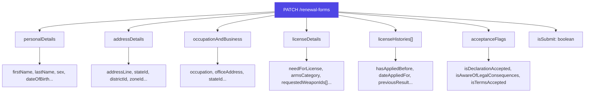

> [!TIP]
> Only include non-empty sections in the PATCH payload. Empty sections are skipped, making progressive saves efficient.

---

## 13. Error Handling & Edge Cases

### 13.1 Error Scenarios

| Scenario                             | Detection                                      | Recovery                                              |
| ------------------------------------ | ---------------------------------------------- | ----------------------------------------------------- |
| Renewal already exists for license   | POST returns 400 with "already exists" message | Auto-search by license number and load existing       |
| Fresh app not submitted              | `isSubmit !== true` in fresh app response      | Show error: "Your application has not been submitted" |
| No fresh app data found              | `freshData` is null after GET                  | Show error: "No fresh application data found"         |
| Renewal ID in URL but record deleted | GET returns 404                                | Show error message, redirect to dashboard             |
| Network failure during save          | PATCH throws error                             | Toast error, retain form data in state                |
| Duplicate create race condition      | `createdRenewalIdRef` guard                    | Skip creation if ref is already set                   |

### 13.2 Duplicate Prevention

```typescript
// Guard against duplicate POST calls (e.g., React strict mode double-mount)
const createdRenewalIdRef = useRef<string | null>(null);

const createDraftRenewalFromFreshApplication = async (...) => {
  if (createdRenewalIdRef.current) return; // ← Skip if already created
  // ...proceed with creation
};
```

### 13.3 Read-Only Mode

When a renewal has `workflowStatus.code === "APPROVED"`:

- Form fields become read-only
- A modal informs the user
- Save/submit buttons are disabled

---

## 14. Best Practices & Optimization

### 14.1 API Call Optimization Summary

| ❌ Don't                                    | ✅ Do                                                |
| ------------------------------------------- | ---------------------------------------------------- |
| Fetch fresh app on every renewal form load  | Only fetch fresh app when creating a NEW renewal     |
| Call both GET APIs simultaneously           | Use `renewalId` check to determine which API to call |
| Send full payload on every save             | Send only changed sections via PATCH                 |
| Upload all documents in sequence            | Upload documents in parallel where possible          |
| Re-create renewal on "already exists" error | Search by license number and load existing           |

### 14.2 Frontend Performance Tips

1. **URL as State:** Persist `renewalId` in URL params — enables direct bookmarking and avoids re-determination logic on refresh
2. **Ref for Create Guard:** Use `useRef` (not `useState`) for `createdRenewalId` to prevent re-renders and race conditions
3. **Section-Based Validation:** Validate only the section being submitted, not the entire form (for draft saves)
4. **Lazy Document Sync:** Use `usePrefilledDocumentSync` hook for background document uploading — doesn't block form rendering
5. **Debounced Auto-Save:** Consider implementing debounced auto-save for long forms

### 14.3 Recommended URL Structure

```
/forms/renewal?applicationId=5                    → New renewal (will auto-create)
/forms/renewal?applicationId=5&renewalId=42       → Edit existing renewal
/forms/renewal?renewalId=42                       → Direct renewal access
```

---

## Summary — Quick Reference Card

```
┌─────────────────────────────────────────────────────────┐
│                 RENEWAL WORKFLOW CHEAT SHEET              │
├─────────────────────────────────────────────────────────┤
│                                                          │
│  1. CHECK: renewalId in URL?                             │
│     YES → GET /renewal-forms/:renewalId → Done           │
│     NO  → Continue to step 2                             │
│                                                          │
│  2. FETCH: GET /applications/:applicationId              │
│     Extract licenseNumber                                │
│                                                          │
│  3. SEARCH: GET /renewal-forms?search=<licenseNumber>    │
│     FOUND  → Load existing renewal → Done                │
│     EMPTY  → Continue to step 4                          │
│                                                          │
│  4. CREATE: POST /renewal-forms (prefilled data)         │
│     Save renewalId → Update URL → Done                   │
│                                                          │
│  5. SAVE:  PATCH /renewal-forms?applicationId=X          │
│  6. SUBMIT: PATCH ...&isSubmit=true + workflow/action     │
│  7. FILES:  POST /renewal-forms/:id/upload-file          │
│                                                          │
│  APIs Used:                                              │
│  • Application GET  — ONLY for initial prefill           │
│  • Renewal GET      — Primary data source                │
│  • Renewal POST     — One-time creation                  │
│  • Renewal PATCH    — All updates                        │
│  • File Upload POST — Per document                       │
│                                                          │
└─────────────────────────────────────────────────────────┘
```
